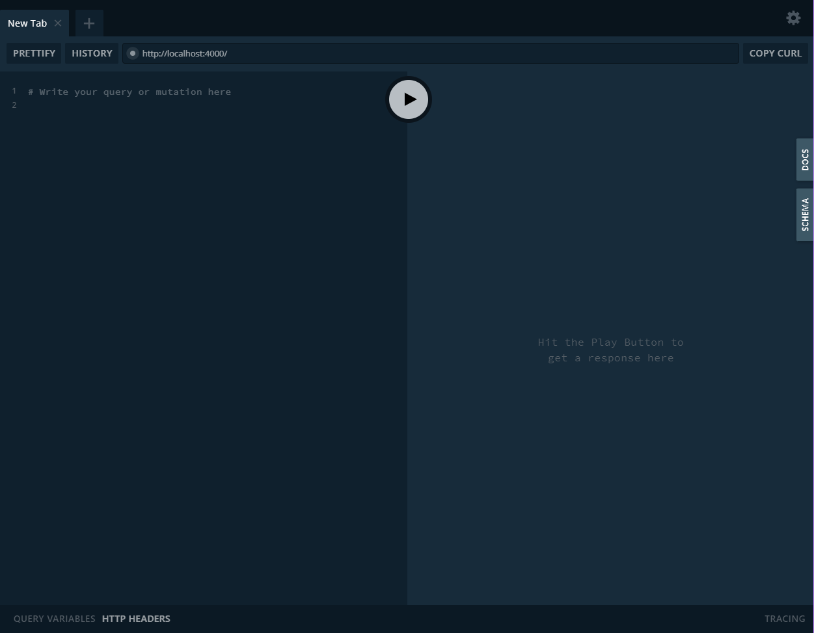
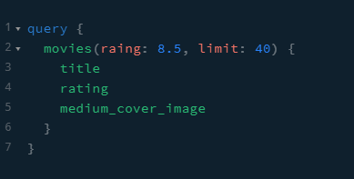
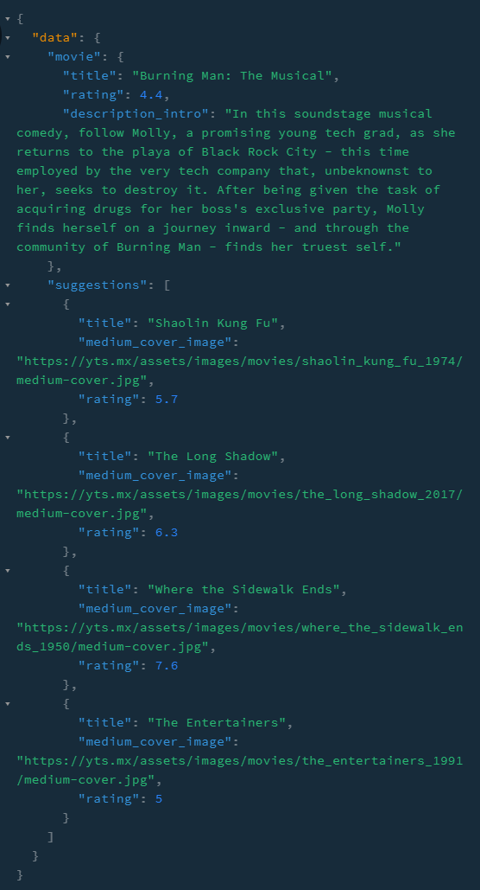

사용 방법
===
다운로드 및 패키지 설치
---
* ### 다운로드

```PowerShell
git clone https://github.com/basalcode/movieql.git
```
* ### 패키지 설치
```PowerShell
npm install

또는

yarn
```
시작하기
---
```PowerShell
npm run start

또는

yarn start
```
localhost:4000으로 실행합니다.<br />
<br />
다음과 같은 화면이 나오면 성공!<br />

<br />


예시
---

* ### query
<br />
왼쪽 쿼리 입력란에 위와같은 쿼리를 입력하면 아래와 같은 결과를 볼 수 있습니다.


* ### result
<br />

> 참조 링크: https://nomadcoders.co/graphql-for-beginners/lectures/1718